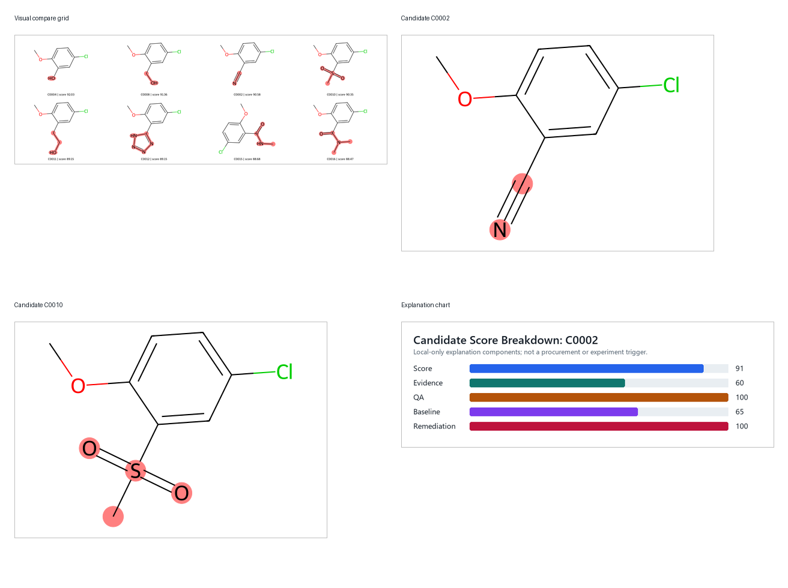
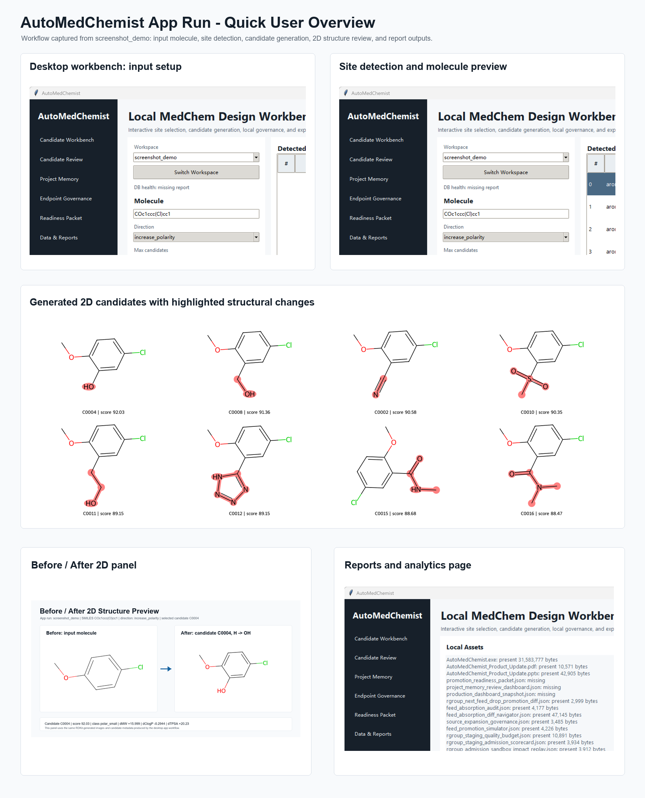
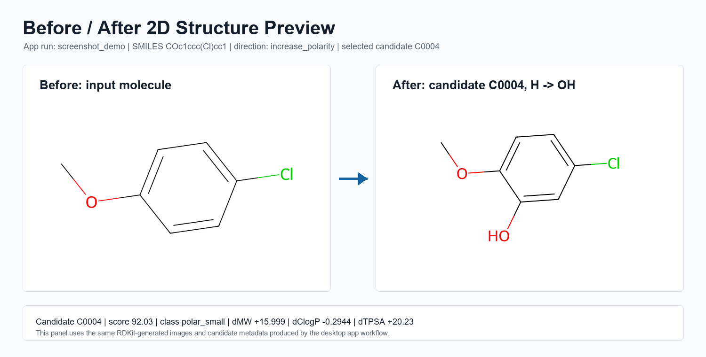
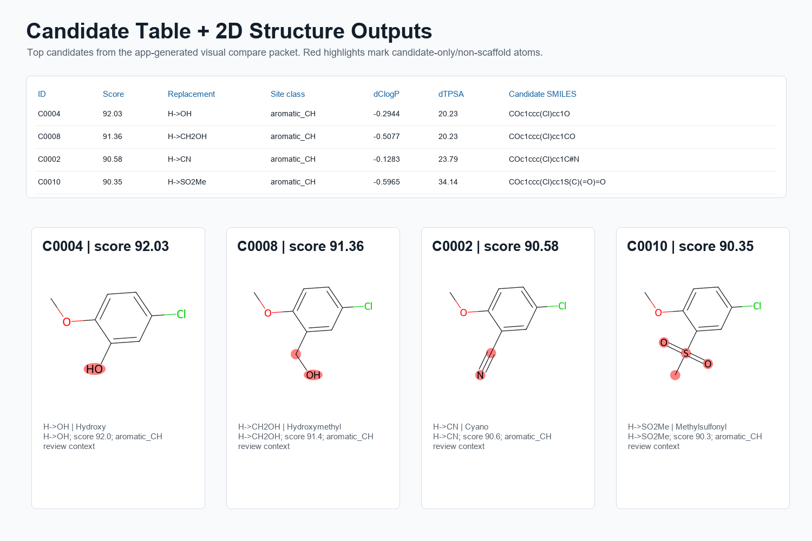

# AutoMedChemist
AutoMedChemist is a local medicinal-chemistry design and review workbench. It starts from a parent SMILES string, detects modification sites, enumerates local analog candidates, scores them with interpretable chemistry and evidence signals, and exports review-ready candidate packages.
--------------------------------------------------------------------------------------------------------
### Struggling to Optimize Your Drug Molecules?

Designing better compounds requires much more than chemical intuition. You need to understand SAR, physicochemical properties, ADMET profiles, synthetic feasibility, and potential toxicity—all at the same time.

**AutoMedChemist** brings these tasks together into a single open-source platform.

Simply provide a parent SMILES, and AutoMedChemist will:

* Detect chemically meaningful modification sites.
* Generate diverse scaffold and substituent analogs.
* Evaluate drug-like properties and molecular descriptors.
* Predict potential liabilities and toxicity alerts.
* Score candidates using interpretable medicinal chemistry evidence.
* Explain why each design is recommended.

Instead of manually exploring thousands of possibilities, AutoMedChemist helps medicinal chemists focus on the most promising candidates within minutes.
## What It Does

AutoMedChemist implements a local, auditable medicinal-chemistry loop:

```text
SMILES
  -> standardize molecule
  -> detect local modification sites
  -> enumerate substituent, functional-group, ring, and R-group candidates
  -> calculate RDKit descriptors
  -> score candidates with property, evidence, route, risk, and novelty signals
  -> explain recommendations
  -> export CSV/SDF/review/report artifacts
```

The current user-facing application is the native Windows desktop shell, launched by `AutoMedChemist.exe` or `python run_native_ui.py`. Streamlit remains available as a legacy/developer path.

## Main Features

### Native Desktop Workbench

- High-DPI Tkinter desktop UI for non-developer use.
- Molecule input by SMILES.
- Workspace/session presets.
- Automatic modification-site detection.
- Candidate generation from the selected site and design direction.
- Candidate table with filters, sorting, detailed explanations, and structure previews.
- Side-by-side candidate comparison and visual structure comparison packets.
- Candidate review boards, review analytics, evidence drawers, remediation queues, and closure workbenches.
- Production/report drill-down views for generated governance and QA artifacts.

### Candidate Enumeration

Supported candidate sources include:

- Curated substituent scans.
- Functional-group replacement rules.
- Public MMP-derived replacement evidence.
- R-group replacement networks.
- Ring-system recommendations from the local SQLite ring library.
- Ring plus R-group joint recommendations.
- Scaffold/linker replacement logic where compatible.

Supported site classes include aromatic C-H, aromatic halide, terminal alkyl tail, ester/amide/carboxylic-acid regions, aryl methoxy soft spots, basic amine transformations, and selected ring/linker contexts.

### Scoring And Explanation

Candidate rows include interpretable signals such as:

- RDKit descriptors and property deltas.
- Direction fit, property score, similarity, synthetic-access score, route score, risk score, and vendor/context fields.
- SAR-neighborhood support.
- Public MMP precedent and contradiction flags.
- ChEMBL/activity and transform evidence where available.
- Evidence-confidence calibration.
- Multi-objective endpoint/profile scoring.
- Novelty and diversity bucket assignment.
- Human-readable fields such as `candidate_explanation_summary`, `why_recommended`, `why_review`, and `evidence_snapshot`.

### Review And Governance

The project includes local-only review workflows for:

- Candidate review packets and decision packets.
- Evidence-quality scorecards.
- Reviewer operations reports.
- Candidate baseline comparison and baseline history.
- Review command-center routing.
- Candidate remediation and closure tracking.
- R-group feed staging, sandbox review, promotion simulation, approval ledgers, rollback rehearsal, and source governance.
- Local DB health, maintenance, regression, smoke, and production dashboard snapshots.

### Local Data Foundation

The full workspace can use a large local SQLite database:

- `data/localmedchem.sqlite`
- Current local size: about 4.18 GB.
- Contains the full processed ring-system table, including about 3.93 million `ring_system` rows in the current snapshot.

The portable ZIP may intentionally omit this database. Full ring search and ring-library recommendation require the database to be present in the main workspace.

## Requirements

Recommended environment:

- Windows 10/11.
- Python 3.10 or newer.
- A project virtual environment at `.venv`.
- Main Python packages:
  - `rdkit`
  - `pandas`
  - `pyyaml`
  - `requests`
  - `streamlit`
  - `python-pptx`
  - `reportlab`
- Development/release packages:
  - `pytest`
  - `pyinstaller`

Important: `AutoMedChemist.exe` is not a fully self-contained computational binary. It opens the native shell, but many buttons call external Python scripts under `scripts/`. For reliable use on another computer, ship or create a working `.venv` beside the project.

## Quick Start

From PowerShell:

```powershell
Set-Location -LiteralPath F:\AutoMedChemist
py -3.10 -m venv .venv
.\.venv\Scripts\python.exe -m pip install --upgrade pip
.\.venv\Scripts\python.exe -m pip install -r requirements.txt
```

Launch the desktop app:

```powershell
.\AutoMedChemist.exe
```

Alternative source launch:

```powershell
.\.venv\Scripts\python.exe run_native_ui.py
```

Run a smoke check:

```powershell
.\.venv\Scripts\python.exe run_native_ui.py --smoke
```

## Typical Desktop Workflow

1. Enter a parent molecule SMILES.
2. Click site detection to find modifiable positions.
3. Choose a site and design direction, such as `increase_polarity` or `metabolism_blocking`.
4. Generate candidates.
5. Review candidate scores, structure previews, evidence snapshots, and `why_recommended` / `why_review` fields.
6. Use review boards, evidence drawers, baseline comparison, or decision packets for local discussion.
7. Export CSV/SDF/report artifacts from the project workspace.

## CLI Examples

Detect modification sites:

```powershell
.\.venv\Scripts\python.exe scripts\detect_sites.py --smiles "COc1ccc(Cl)cc1"
```

Generate candidates:

```powershell
.\.venv\Scripts\python.exe scripts\run_mvp.py --smiles "COc1ccc(Cl)cc1" --direction increase_polarity --max-candidates 50
```

Run a ring search summary:

```powershell
.\.venv\Scripts\python.exe scripts\search_ring_systems.py --summary
```

Build review artifacts:

```powershell
.\.venv\Scripts\python.exe scripts\build_candidate_review_board.py --project-name demo
.\.venv\Scripts\python.exe scripts\build_candidate_review_analytics.py --project-name demo
.\.venv\Scripts\python.exe scripts\build_candidate_decision_packet.py --project-name demo
```

Run the broader production gate:

```powershell
.\.venv\Scripts\python.exe scripts\run_production_ci.py
```

## Important Artifacts

- `AutoMedChemist.exe` - native desktop shell.
- `run_native_ui.py` / `run_app.py` - source launchers for the native app.
- `app/native_shell.py` - Tkinter desktop application.
- `src/localmedchem/` - core library modules.
- `scripts/` - CLI, build, ingestion, governance, report, and release commands.
- `data/localmedchem.sqlite` - full local SQLite data store.
- `data/substituents/core_substituent_library.yaml` - curated substituent library.
- `data/rules/` - direction rules, site SMARTS, profiles, policies, and transformation rules.
- `data/replacements/` - ring and R-group replacement sources.
- `data/projects/<project>/candidates.csv` - generated candidate table.
- `data/projects/<project>/candidates.sdf` - generated candidate structures.
- `data/releases/` - smoke, dashboard, package, release, and error reports.
- `docs/` - generated reports and review packets.

## Packaging And Distribution

The current project can be shared, but the release model matters.

### Source/Workspace Package

Best for internal users and reviewers. Include:

- Project source folders: `app/`, `src/`, `scripts/`, `data/`, `docs/`.
- `AutoMedChemist.exe`.
- `requirements.txt` and `pyproject.toml`.
- A prepared `.venv`, or clear instructions to create one.
- `data/localmedchem.sqlite` if full ring-search and ring-recommendation features are required.

### Portable Native Package

`AutoMedChemist_Portable.zip` includes the native app and project files, but may omit the 4 GB SQLite database. Without `data/localmedchem.sqlite`, the app can still open and some workflows can run, but full ring-library search/recommendation will be incomplete.

### Single EXE Limitation

The current `AutoMedChemist.exe` should not be treated as a fully standalone product installer. The UI is packaged, but computational actions still depend on an external Python runtime and installed project dependencies. For a more robust public release, bundle a managed Python runtime or modify the build so pipeline actions no longer depend on system `python`.


## Troubleshooting

### The EXE Opens, But Buttons Fail

Most native UI actions call Python scripts. Create `.venv` and install dependencies:

```powershell
py -3.10 -m venv .venv
.\.venv\Scripts\python.exe -m pip install -r requirements.txt
```

### Failed To Launch `E:\Programe\python.exe`

This indicates a broken Windows Python app alias or PATH entry. The app tried to call `python`, but Windows redirected it to a non-existing interpreter.

Recommended fix:

1. Create `.venv` in the project root.
2. Launch the app again; it will prefer `.venv\Scripts\python.exe`.
3. Optionally disable Windows `python.exe` App Execution Alias in Windows Settings.
4. Ensure the real Python directory appears before `WindowsApps` in PATH.

Useful checks:

```powershell
where python
py -0p
.\.venv\Scripts\python.exe -c "import rdkit, pandas, yaml, requests; print('ok')"
```

### Missing Or Incomplete Ring Search

Check that the full database exists:

```powershell
Get-Item .\data\localmedchem.sqlite
```

If the file is absent, copy it from the full workspace or rebuild/import the ring data before using full ring-library recommendation.

### RDKit Installation Problems

If `pip install rdkit` fails on a target machine, use a Python distribution/environment that supports RDKit cleanly, or prepare the `.venv` on a compatible machine and ship it with the workspace.

### Streamlit Or Pillow Version Warnings

The native shell is the maintained UI. Streamlit is legacy/developer support. If Streamlit reports Pillow compatibility issues, prefer the native UI unless the legacy dashboard is specifically needed.

## Project Layout

```text
AutoMedChemist/
  app/                 Native UI and legacy app entry points
  src/localmedchem/    Core chemistry, scoring, evidence, DB, review, and governance modules
  scripts/             CLI tools, builds, reports, data import, QA, and release commands
  data/                Local libraries, rules, project outputs, SQLite DB, and release reports
  docs/                Generated documentation and review/report artifacts
  tests/               Pytest coverage
  dist/                Portable package outputs and launchers
  build/               Build intermediates
```

## Project Boundary

AutoMedChemist is for local medicinal-chemistry idea generation, triage, and review. Supplier availability, route classes, quote fields, experiment plans, and feedback-import gates are treated as local planning or defensive governance context only. The application does not automate procurement, supplier purchase, real experiment execution, or unreviewed real feedback import.


## App Screenshots

### 2D Visual Gallery



---

### Quick User Overview



---

### Before & After 2D Clean Panel



---

### Candidate Table with 2D Outputs




